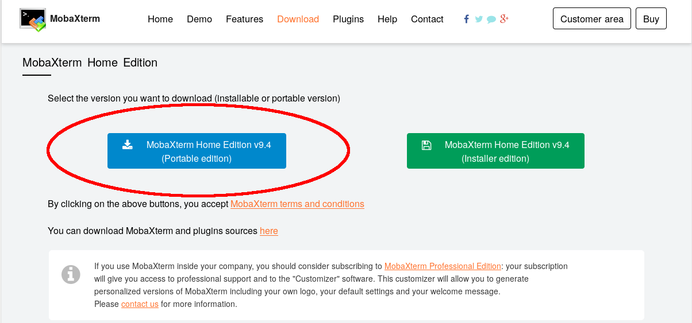

# CloudCluster

## Logging in 

### Install MobaXterm

To use the HPC from a Windows machine, you need a way to connect - we recommend you install **MobaXterm**.
This is available from [http://mobaxterm.mobatek.net/download-home-edition.html](http://mobaxterm.mobatek.net/download-home-edition.html).
On a University machine, you need to install the **Portable edition** (highlighted in the image below):



The download is a zip file that contains three other files. You should **extract these files**, for example to your desktop, before you use them.
Do not run MobaXterm directly from the zip file.

## Cluster log in details

``USERNAME@ec2-54-194-192-151.eu-west-1.compute.amazonaws.com``

# Submit a pre-prepared job to the queue

Once you have logged in, here's how to submit your first job quickly 

Clone this repository
```
git clone https://github.com/mikecroucher/CloudCluster
```

Navigate to the directory containing the example
```
cd CloudCluster/MPI_hello_world/
```

Submit it
```
qsub submit_mpi.sh
```

See the status of your jobs
```
qstat
```

See the status of all jobs, from all users, running and waiting on the cluster

```
qstat -u '*'
```

Once the job has completed, take a look at the files that have been created with the `ls` command.
Let's look at the job submission script

```
more submit_mpi.sh
```
gives

```
#!/bin/bash
#$ -pe mpislots 4
#$ -cwd

#Save details of node placement
cat $PE_HOSTFILE  > node_info_$JOB_ID.txt
#Run this or module commands won't work
source /etc/profile.d/alces-clusterware.sh

#Load the MPI module
module load  mpi/openmpi/1.10.2/gcc-4.8.5
#Compile
mpicc MPI_hello_world.c -o MPI_hello_world
#Run
mpirun  ./MPI_hello_world
```

## Interative sessions on worker nodes

You can request an interactive session on the worker nodes with 2 MPI slots with the command
```
qrsh -pe mpislots 2
```
This will allow you to compile and run small MPI jobs interactively. 
Please do not request large numbers of cores in interactive sessions since we have to pay for them all!

Note that you cannot submit batch jobs from a qrsh session.
